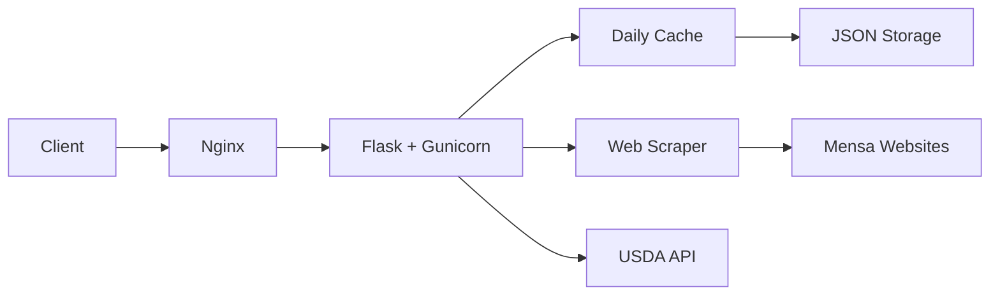

<div align="center">

# 🍽️ JenaMensa

### Smart University Cafeteria Menu Finder for Jena, Germany

[](https://jenamensa.online)

[](https://www.docker.com/)
[](https://reactjs.org/)
[](https://flask.palletsprojects.com/)
[](https://nginx.org/)
[](https://www.python.org/)

*A full-stack application for discovering, comparing, and analyzing university mensa menus with comprehensive nutrition information and intelligent dietary filtering*

**✨ [Try it Live at jenamensa.online](https://jenamensa.online) ✨**

[🚀 Quick Start](#-quick-start-with-docker) • [📖 Documentation](#-api-endpoints) • [🛠️ Development](#-docker-commands) • [💡 Features](#-features)

</div>

---

## ✨ Features

<table>
<tr>
<td width="50%">

### 🕐 **Daily Caching System**
- Automatic data fetching at 2 AM daily
- Lightning-fast responses (<100ms)
- Persistent storage with auto-recovery
- Smart daily updates

</td>
<td width="50%">

### 🍕 **Menu Intelligence**
- Multi-mensa comparison
- Nutrition information (USDA API)
- Dietary filtering & preferences
- Multi-language support

</td>
</tr>
<tr>
<td width="50%">

### ⚡ **Performance**
- Optimized Docker setup
- Nginx with gzip compression
- Static asset caching
- Health monitoring

</td>
<td width="50%">

### 🔐 **Production Ready**
- Security headers configured
- Non-root containers
- Environment-based configs
- Automated deployments

</td>
</tr>
</table>

---

<div align="center">

## 🚀 [**Try JenaMensa Live →**](https://jenamensa.online)

Experience all features in action at **[jenamensa.online](https://jenamensa.online)**

*No installation required • Instant access • Full functionality*

</div>

---

## 🚀 Quick Start with Docker

### Prerequisites

Before you begin, ensure you have the following installed:

| Tool | Version | Download |
|------|---------|----------|
| 🐳 Docker | 20.10+ | [Get Docker](https://docs.docker.com/get-docker/) |
| 🎼 Docker Compose | 2.0+ | [Get Compose](https://docs.docker.com/compose/install/) |
| 🔑 USDA API Key | Free | [Sign Up](https://fdc.nal.usda.gov/api-key-signup.html) |

### 🎯 Three-Step Setup

```bash
# 1️⃣ Clone the repository
git clone <your-repo-url>
cd JenaMensa

# 2️⃣ Configure your environment
cp backend/.env.example backend/.env
nano backend/.env  # Add your USDA_API_KEY

# 3️⃣ Launch with Docker
docker-compose up -d --build
```

### 🌐 Access Your Application

| Service | URL | Description |
|---------|-----|-------------|
| 🌟 **Live Demo** | **[jenamensa.online](https://jenamensa.online)** | **Production site (try it now!)** |
| 🎨 Frontend | [http://localhost](http://localhost) | Local development interface |
| 🔧 Backend API | [http://localhost:6000/api/health](http://localhost:6000/api/health) | API health check |
| 📊 Cache Status | [http://localhost:6000/api/cache-status](http://localhost:6000/api/cache-status) | View cache information |

---

## 🛠️ Docker Commands

<details>
<summary><b>📦 Container Management</b></summary>

```bash
# Start all services
docker-compose up -d

# Stop all services
docker-compose down

# Restart a specific service
docker-compose restart backend
docker-compose restart frontend

# Check container status
docker-compose ps

# View resource usage
docker stats JenaMensa-backend JenaMensa-frontend
```

</details>

<details>
<summary><b>🔍 Debugging & Logs</b></summary>

```bash
# View all logs (live)
docker-compose logs -f

# View specific service logs
docker-compose logs -f backend
docker-compose logs -f frontend

# View last 100 lines
docker-compose logs --tail=100

# Check backend health
curl http://localhost:6000/api/health
```

</details>

<details>
<summary><b>🔨 Building & Rebuilding</b></summary>

```bash
# Rebuild after code changes
docker-compose up -d --build

# Force rebuild without cache
docker-compose build --no-cache
docker-compose up -d

# Rebuild specific service
docker-compose build backend
docker-compose up -d backend
```

</details>

<details>
<summary><b>🧹 Cleanup & Maintenance</b></summary>

```bash
# Stop and remove containers
docker-compose down

# Remove with volumes (⚠️ deletes data)
docker-compose down -v

# Clean up Docker system
docker system prune -a
docker volume prune
```

</details>

---

## 📁 Project Architecture

```
JenaMensa/
│
├── 🔙 backend/
│   ├── 🐳 Dockerfile              # Backend container definition
│   ├── 🚫 .dockerignore          # Build exclusions
│   ├── 🎯 app.py                 # Flask app with scheduler
│   ├── 📦 requirements.txt       # Python dependencies
│   ├── 🕷️ scraper.py            # Web scraping engine
│   ├── 🌐 translator.py         # Translation service
│   ├── 🥗 nutrition_usda.py     # USDA nutrition API
│   ├── ⚡ daily_cache.py        # Caching system
│   ├── 📖 CACHING.md            # Cache documentation
│   ├── 🗂️ cache/                # Menu cache storage
│   └── 🔐 .env                  # Environment config
│
├── 🎨 frontend/
│   ├── 🐳 Dockerfile            # Frontend container
│   ├── 🚫 .dockerignore        # Build exclusions
│   ├── ⚙️ nginx.conf           # Nginx configuration
│   ├── 📦 package.json         # Node dependencies
│   └── 📂 src/                 # React source code
│
└── 🎼 docker-compose.yml       # Container orchestration
```

---

## 🔧 Configuration

### Environment Variables

Create a `.env` file in the `backend/` directory:

```env
# Production/Development mode
FLASK_ENV=production

# USDA API Key (required)
# Get yours at: https://fdc.nal.usda.gov/api-key-signup.html
USDA_API_KEY=your_usda_api_key_here

# Optional: Cache settings
CACHE_REFRESH_HOUR=2
```

### Port Configuration

Default ports can be customized in `docker-compose.yml`:

```yaml
services:
  frontend:
    ports:
      - "8080:80"    # Change 8080 to your desired port
  
  backend:
    ports:
      - "5000:6000"  # Change 5000 to your desired port
```

---

## 🏗️ Technical Stack

<div align="center">

### Backend Architecture



</div>

| Component | Technology | Purpose |
|-----------|-----------|---------|
| 🐍 **Backend** | Flask + Gunicorn | API server with 2 workers, 120s timeout |
| ⚛️ **Frontend** | React + Vite | Modern UI with fast build times |
| 🌐 **Web Server** | Nginx | Static files, reverse proxy, compression |
| 📦 **Caching** | JSON + APScheduler | Daily auto-refresh at 2 AM |
| 🔍 **Scraping** | BeautifulSoup4 | Menu data extraction |
| 🌍 **Translation** | Google Translate | Multi-language support |
| 🥗 **Nutrition** | USDA FoodData Central | Comprehensive nutrition info |

### Key Features

- ✅ **Multi-stage builds** for optimized image size
- ✅ **Health checks** for both services
- ✅ **Non-root users** for security
- ✅ **Persistent volumes** for cache storage
- ✅ **Gzip compression** for faster loading
- ✅ **Static asset caching** (1 year)
- ✅ **Private bridge network** for inter-service communication

---

## 📖 API Endpoints

### Core API

| Method | Endpoint | Description | Response Time |
|--------|----------|-------------|---------------|
| `GET` | `/api/health` | Service health check | ~10ms |
| `GET` | `/api/mensas` | List all mensas | <100ms |
| `GET` | `/api/menus?date=YYYY-MM-DD` | All menus (optional date) | <100ms |
| `GET` | `/api/mensa/<mensa_key>` | Specific mensa menu | <100ms |
| `POST` | `/api/suggest` | Dietary preference suggestions | <200ms |

### Cache Management

| Method | Endpoint | Description | Use Case |
|--------|----------|-------------|----------|
| `GET` | `/api/cache-status` | Cache validity & info | Monitoring |
| `POST` | `/api/refresh-cache` | Manual cache refresh | Admin/Testing |

> 📚 **Detailed Documentation**: See [backend/CACHING.md](backend/CACHING.md) for complete API documentation

---

## 🔍 Troubleshooting

<details>
<summary><b>🔴 Backend Not Responding</b></summary>

```bash
# Step 1: Check backend logs
docker-compose logs backend

# Step 2: Verify health endpoint
curl http://localhost:6000/api/health

# Step 3: Restart backend
docker-compose restart backend

# Step 4: Check if port is already in use
lsof -i :6000
```

</details>

<details>
<summary><b>🔴 Frontend Can't Connect to Backend</b></summary>

```bash
# Verify both containers are running
docker-compose ps

# Check network connectivity
docker-compose exec frontend ping backend

# Inspect Nginx configuration
docker-compose exec frontend cat /etc/nginx/nginx.conf

# Restart both services
docker-compose restart
```

</details>

<details>
<summary><b>🔴 Out of Disk Space</b></summary>

```bash
# Check disk usage
docker system df

# Remove unused images and containers
docker system prune -a

# Remove unused volumes (⚠️ careful with data)
docker volume prune

# Remove specific old images
docker images
docker rmi <image-id>
```

</details>

<details>
<summary><b>🔴 Cache Not Updating</b></summary>

```bash
# Check cache status
curl http://localhost:6000/api/cache-status

# View scheduler logs
docker-compose logs backend | grep -i "cache\|schedule"

# Manually refresh cache
curl -X POST http://localhost:6000/api/refresh-cache

# Check cache file
docker-compose exec backend ls -lh cache/
```

</details>

<details>
<summary><b>🔴 Complete Reset</b></summary>

```bash
# Nuclear option: complete rebuild
docker-compose down -v
docker system prune -a
docker-compose build --no-cache
docker-compose up -d
```

</details>

---

## 📊 Monitoring & Performance

### Health Checks

Both services include automated health monitoring:

```yaml
Backend:  Python request to /api/health every 30s
Frontend: wget request to homepage every 30s
```

Check service health:

```bash
# View health status
docker-compose ps

# Continuous health monitoring
watch -n 5 docker-compose ps
```

### Performance Metrics

```bash
# Real-time resource usage
docker stats

# Specific containers
docker stats JenaMensa-backend JenaMensa-frontend

# Historical logs with timestamps
docker-compose logs -t --tail=100

# Export metrics
docker stats --no-stream --format "table {{.Container}}\t{{.CPUPerc}}\t{{.MemUsage}}"
```

---

## 🔐 Security Best Practices

### ✅ Already Implemented

- ✔️ Non-root container users
- ✔️ Nginx security headers (X-Frame-Options, X-Content-Type, X-XSS-Protection)
- ✔️ Environment-based configuration
- ✔️ Private Docker network
- ✔️ .dockerignore for sensitive files
- ✔️ Health check endpoints

### 🚀 Production Deployment Checklist

- [ ] Enable HTTPS with SSL certificates (Let's Encrypt)
- [ ] Set up reverse proxy with SSL termination
- [ ] Configure firewall rules (UFW, iptables)
- [ ] Use Docker secrets for sensitive data
- [ ] Implement rate limiting
- [ ] Set up log aggregation (ELK stack)
- [ ] Configure automated backups
- [ ] Enable container security scanning
- [ ] Set up monitoring alerts
- [ ] Use container orchestration (Docker Swarm/Kubernetes)

### 🔒 Environment Security

```bash
# Never commit .env files
echo "backend/.env" >> .gitignore

# Use strong API keys
# Rotate credentials regularly
# Limit API key permissions
```

---

## 🚢 Deployment Guide

### 🏢 Production Deployment

<details>
<summary><b>Using Docker Compose (Simple)</b></summary>

```bash
# 1. Clone on production server
git clone <your-repo-url>
cd JenaMensa

# 2. Set production environment
cp backend/.env.example backend/.env
nano backend/.env  # Set FLASK_ENV=production

# 3. Deploy with SSL (using Traefik/nginx-proxy)
docker-compose -f docker-compose.yml -f docker-compose.prod.yml up -d

# 4. Set up automated backups
crontab -e
# Add: 0 3 * * * docker run --rm -v jenamensa_cache:/backup alpine tar czf /backup/backup-$(date +%Y%m%d).tar.gz /backup/cache
```

</details>

<details>
<summary><b>Using Kubernetes (Advanced)</b></summary>

```bash
# 1. Build and push images
docker build -t your-registry/jenamensa-backend:latest backend/
docker build -t your-registry/jenamensa-frontend:latest frontend/
docker push your-registry/jenamensa-backend:latest
docker push your-registry/jenamensa-frontend:latest

# 2. Deploy to Kubernetes
kubectl apply -f k8s/

# 3. Verify deployment
kubectl get pods -n jenamensa
kubectl get services -n jenamensa
```

</details>

### 💻 Development Setup

For local development without Docker:

<details>
<summary><b>Backend Development</b></summary>

```bash
cd backend

# Create virtual environment
python -m venv venv
source venv/bin/activate  # On Windows: venv\Scripts\activate

# Install dependencies
pip install -r requirements.txt

# Run development server
export FLASK_ENV=development
export USDA_API_KEY=your_key_here
python app.py
```

</details>

<details>
<summary><b>Frontend Development</b></summary>

```bash
cd frontend

# Install dependencies
npm install

# Run development server with hot reload
npm run dev

# Build for production
npm run build
```

</details>

---

## 🤝 Contributing

We welcome contributions! Here's how you can help:

1. 🍴 **Fork** the repository
2. 🌿 **Create** a feature branch (`git checkout -b feature/AmazingFeature`)
3. 💻 **Make** your changes
4. ✅ **Test** with Docker: `docker-compose up --build`
5. 📝 **Commit** your changes (`git commit -m 'Add some AmazingFeature'`)
6. 🚀 **Push** to the branch (`git push origin feature/AmazingFeature`)
7. 🎉 **Open** a Pull Request

### Code Style

- Python: Follow PEP 8
- JavaScript: Follow Airbnb Style Guide
- Commits: Use [Conventional Commits](https://www.conventionalcommits.org/)

---

## 📄 License

This project is open source and available under the [MIT License](LICENSE).

---

## 🆘 Support & Resources

### 📚 Documentation

- [Caching System Documentation](backend/CACHING.md)
- [Docker Documentation](https://docs.docker.com/)
- [Flask Documentation](https://flask.palletsprojects.com/)
- [React Documentation](https://reactjs.org/)

### 💬 Get Help

Having issues? Try these steps:

1. Check the [Troubleshooting](#-troubleshooting) section
2. Review logs: `docker-compose logs`
3. Verify prerequisites (Docker, Docker Compose versions)
4. Ensure ports 80 and 6000 are not in use
5. Check [Issues](../../issues) for similar problems
6. Open a new issue with logs and system info

### 🔗 Useful Links

- [USDA FoodData Central](https://fdc.nal.usda.gov/)
- [Docker Best Practices](https://docs.docker.com/develop/dev-best-practices/)
- [Flask Deployment](https://flask.palletsprojects.com/en/stable/deploying/)

---

<div align="center">

### 🌟 Star this repository if you find it helpful!

**🌐 [Visit Live Website here: jenamensa.online](https://jenamensa.online) 🌐**

Created with ☕ by [Kohulan Rajan](https://kohulanr.com)

[](https://kohulanr.com)
[](https://github.com/Kohulan)

---

**JenaMensa** • Making university dining decisions easier, one meal at a time 🍽️

</div>